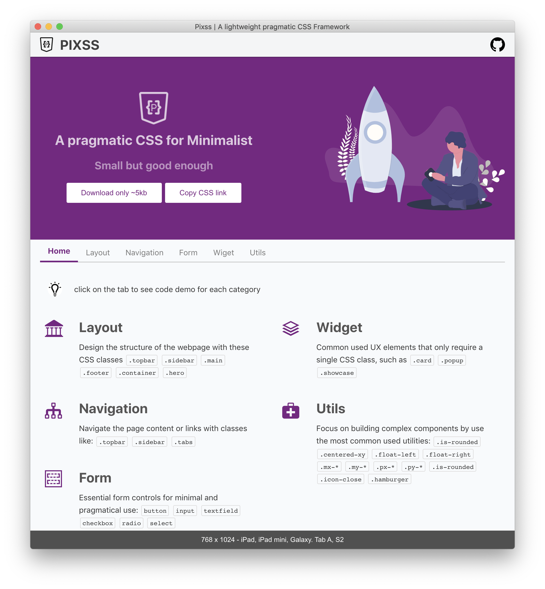

<div style="text-align: center">
  
  <h1>PIXSS</h1>
  <h5> 🚀 gzipped size: < 5kb </h5>
</div>


Pixss provides a minimal setup of styles for a programatic and clean starting point. Only **< 5 kb gzipped**! It is specially designed for better performance and higher productivity. 

<div style="text-align: center">
  <h5>🎯 Small but good enough</h5>
  <span>sample with @pixss</span>
</div>

<div style="text-align: center">
  
</div>

## 📚 Document with [Demo](https://vikbert.github.io/pixss/)

## 🗳 Download with `npm`
```bash
 npm install pixss 
```

Then use the css files from `node_modules/pixss`
```bash
├── dist
│   └── styles
│       ├── pixss.css
│       ├── pixss.css.map
│       ├── pixss.min.css
│       └── pixss.min.css.map
```


## 🗳  Download from `Homepage`
click on the download button on homepage.
[pixss home]([https://link](https://vikbert.github.io/pixss/))

## License
MIT © vikbert


