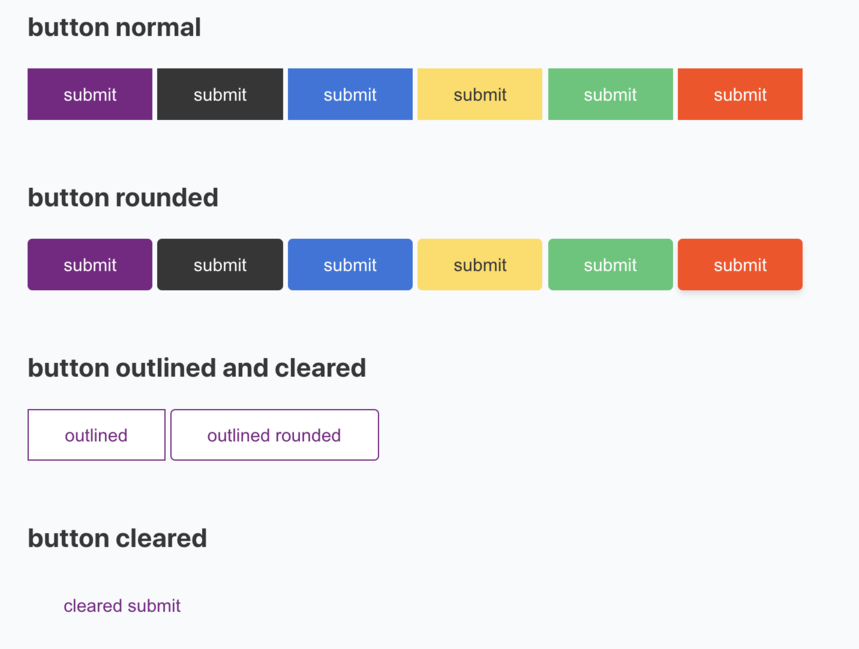
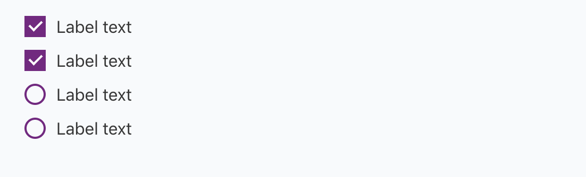
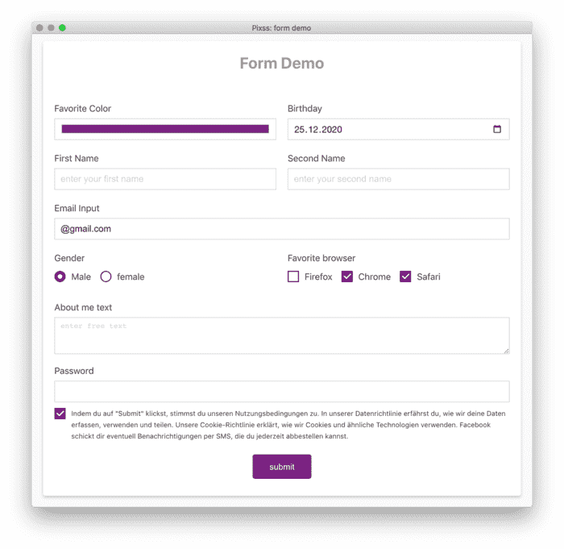

# Form

`pixss` provides the basic styling for creating a web form quickly. 

## Button [→ Demo ](https://vikbert.github.io/pixss/examples/button.html)

By using the following utility classes, `pixss` can fullfill the most of requirements to create different types of buttons.

| type  | utility classes                                                                  |
|-------|----------------------------------------------------------------------------------|
| style | `is-outlined`, `is-cleared`                                                      |
| color | `is-primary`, `is-secondary`, `is-info`, `is-warning`, `is-success`, `is-danger` |




## Checkbox [→ Demo ](https://vikbert.github.io/pixss/examples/checkbox.html)
`pixss` provides the two unitility classes `.checkbox`, `.radio` to customize the standard html elements: input:checkbox and input:radio.



**checkbox input**
```html
<label class="checkbox">
  Label text
  <input type="checkbox" name="gender" checked="checked">
  <span></span>
</label>
```

**radio input**
```html
<label class="radio">
  Female
  <input type="radio" name="gender">
  <span></span>
</label>
<label class="radio">
  Male
  <input type="radio" name="gender" checked="checked">
  <span></span>
</label>
```

## Form Elements [→ Demo ](https://vikbert.github.io/pixss/examples/form.html)
`pixss` provides also the basic standard styling for the following form elements.

```bash
input[type='color']
input[type='date']
input[type='datetime']
input[type='datetime-local']
input[type='email']
input[type='month']
input[type='number']
input[type='password']
input[type='search']
input[type='tel']
input[type='text']
input[type='url']
input[type='week'],
```

An form example is implemented with the basic form elememts provided by `pixss`



