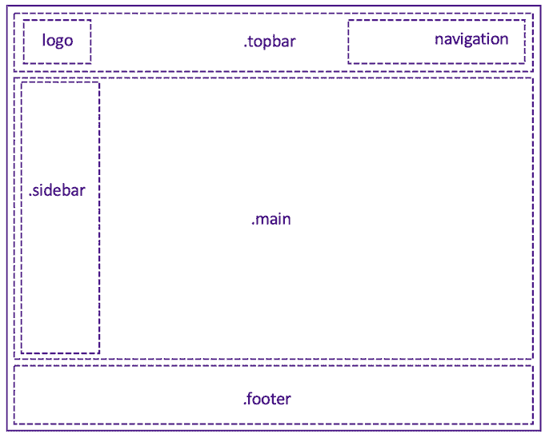

# Layout
<iframe width="560" height="315" src="https://www.youtube.com/embed/H60Kx0e5yDA" frameborder="0" allow="accelerometer; autoplay; clipboard-write; encrypted-media; gyroscope; picture-in-picture" allowfullscreen></iframe>

`pixss` defines the most necessary classes to construct the simple layout with the common used classes easily:
- `.topbar`
- `.sidebar`
- `.main`
- `.container`
- `.footer`



## `.topbar`
define the Topbar with `fixed` position in page header. By using utility class `space-between` the child nodes can be displayed like the following example: the `logo` element will be positioned on the left, and the `navigation` elements will be showed on the right side.

```html
  <div class='.topbar'>
    <div class="container space-between">
        <div>logo</div>
        <div>navigation</div>
    </div>
  </div>
```

## `.sidebar` & `is-open`
define the sidebar with `fixed` posistion on the left side of page. Sidebar is invisible as default, by using `.is-open` can be set to visible.

```html


```


## `.main`

## `.footer`

## `.container`

## `.hero`
