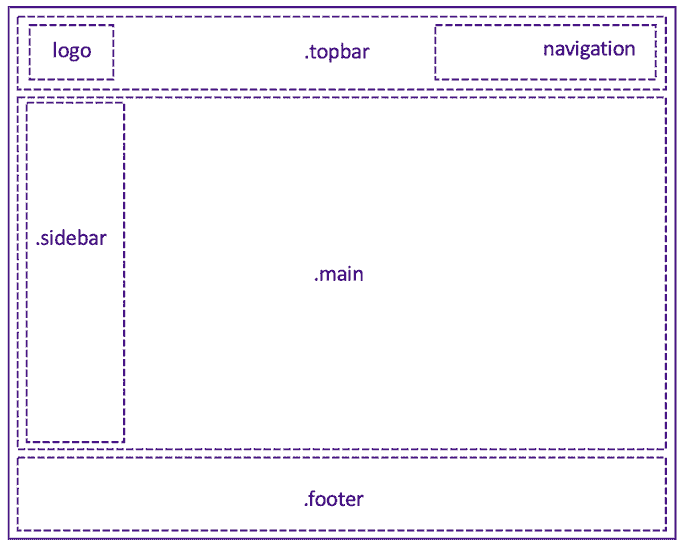

# Layout
construct the page layout with the common used classes easily.



## `.topbar`
define the Topbar with `fixed` position in page header
```html
  <div class='.topbar'>
    <div>logo</div>
    <div>navi</div>
  </div>
```

## `.sidebar`

## `.main`

## `.footer`

## `.container`

## `.hero`
